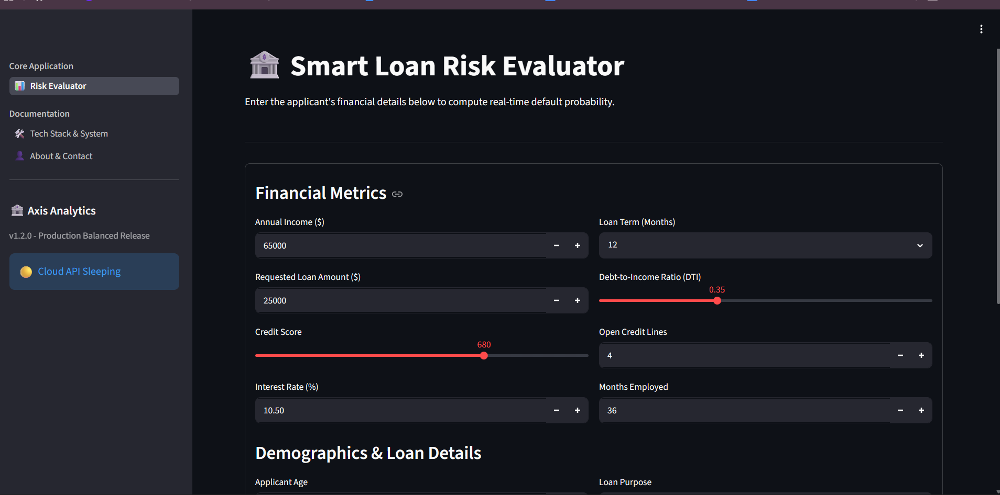
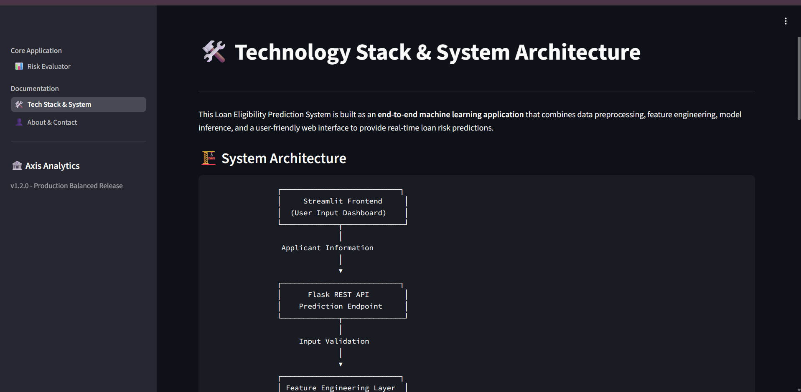
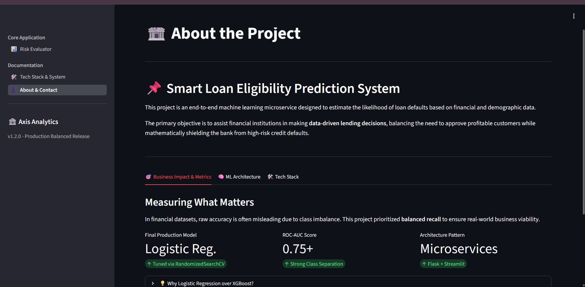

# 🏦 Loan Eligibility Prediction System


## 🌍 Live Demo

### Frontend (Streamlit UI)
https://loan-ui-dfbh.onrender.com

### Backend (Flask API)
https://loan-api-iuqc.onrender.com

> > **Note:** This project uses Render's free hosting. If predictions don't work immediately, please visit the backend once to wake it:
>
> Backend: https://loan-api-iuqc.onrender.com
>
> Wait until you see **"🏦 Loan Eligibility API is actively running!"**, then open:
>
> Frontend: https://loan-ui-dfbh.onrender.com


A machine learning–powered web application that predicts **loan eligibility and default risk** using customer financial and demographic information. The project follows a **microservices architecture**, where a **Streamlit frontend** communicates with a **Flask backend API** hosting a trained machine learning pipeline.

✔ Compared 3 machine learning models  
✔ Applied feature engineering and hyperparameter tuning  
✔ Achieved ROC-AUC of 0.7539 with tuned Logistic Regression  
✔ Built a complete Flask + Streamlit web application for loan eligibility prediction  
✔ Dual-Server Microservices: Decoupled presentation layer (Streamlit) and mathematical inference engine (Flask API).  
---

# 📌 Project Overview

Financial institutions need to evaluate loan applicants accurately while minimizing the risk of defaults. This project automates that process by analyzing applicant details and predicting whether an applicant is likely to default on a loan.

The application combines:

- 🧠 Machine Learning
- ⚙️ Flask REST API
- 🖥️ Streamlit Frontend
- 📊 Feature Engineering
- 🔍 Hyperparameter Tuning
- 🚀 End-to-End Deployment Ready Architecture

---
## Application Preview

### Home Page


---

### TechStack & System Architecture


---

### About Page


---

# 🚀 Key Features

- Predicts loan default risk in real time.
- User-friendly Streamlit web interface.
- Flask API for model inference.
- Automated preprocessing pipeline.
- Custom feature engineering.
- Hyperparameter tuning using `RandomizedSearchCV`.
- Handles categorical and numerical features seamlessly.
- Deployable as a standalone web application.

---

# 🤖 Machine Learning Pipeline

## Data Preprocessing

- Missing value handling
- Categorical encoding
- Numerical scaling
- Column transformations using Scikit-Learn pipelines

## Feature Engineering

The following custom features were created:

- ✅ `Income_Loan_Ratio`– Measures repayment capacity.
- ✅ `Employment_Stability`– Years of employment.
- ✅ `High_DTI_Flag`– Flags financially stressed applicants.
- ✅ `credit_score_category`– Converts raw credit scores into risk categories.
- ✅ `log_income`– Reduces skewness.
- ✅ `log_loan_amount`-Normalizes loan distribution.

These engineered features improved the predictive capability of the final model.

---

# 📈 Model Selection

Three machine learning models were evaluated: Logistic Regression, Random Forest, and XGBoost.

Although Random Forest achieved higher overall accuracy (87%), it struggled to identify loan defaults, achieving only 20% recall for the default class.

After comparing ROC-AUC, recall, and overall performance, Logistic Regression was selected as the final production model because it achieved the highest ROC-AUC (0.7539) and detected approximately 69% of default cases, making it more suitable for credit risk assessment.


| Model               | ROC-AUC    |
| ------------------- | ---------- |
| Logistic Regression | **0.7539** ✅|
| XGBoost             | 0.7441     |
| Random Forest       | 0.7311     |

Three machine learning algorithms were evaluated: Logistic Regression, Random Forest, and XGBoost.

XGBoost achieved the highest ROC-AUC (0.7883), indicating the strongest ranking performance.
Random Forest achieved the highest overall accuracy (85.96%) but showed lower recall for the default class.
Logistic Regression provided the best balance between interpretability and recall, making it a practical baseline for credit-risk prediction.

Depending on business objectives, different models may be preferred. The project includes implementations and evaluation of all three models.

After comparison, **Logistic Regression** was selected as the production model because it achieved the highest ROC-AUC score and provided strong, interpretable performance.

---

# 📊 Final Model Performance

## Logistic Regression (Hyperparameter Tuned)

| Metric | Score |
|----------|--------|
| ROC-AUC Score | **0.7837** |
| Accuracy | **73.38%** |
| Precision (Default Class) | **0.31** |
| Recall (Default Class) | **0.68** |
| F1-Score (Default Class) | **0.42** |

The model successfully identifies a significant proportion of risky loan applicants while maintaining competitive overall performance.

---

# 🛠️ Hyperparameter Tuning

Randomized Search Cross Validation was used to optimize the Logistic Regression model.

Best Parameters:

```python
{
    "C": 0.017638,
    "penalty": "l1",
    "solver": "saga",
    "max_iter": 1000
}
```

Cross Validation:

- 3-Fold Cross Validation
- 50 Random Parameter Combinations
- Optimization Metric: **ROC-AUC**

---

# 🏗️ System Architecture

```
                ┌──────────────────────┐
                │   Streamlit Frontend │
                │      (Port 8501)     │
                └──────────┬───────────┘
                           │
                    HTTP POST Request
                           │
                           ▼
                ┌──────────────────────┐
                │      Flask API       │
                │      (Port 5000)     │
                └──────────┬───────────┘
                           │
                           ▼
                ┌──────────────────────┐
                │  ML Prediction Model │
                │ Logistic Regression  │
                └──────────┬───────────┘
                           │
                           ▼
                Loan Risk Prediction
```

# 🚀 Deployment

The application follows a two-service deployment architecture:

### Frontend
- **Framework:** Streamlit
- **Hosting Platform:** Render
- **Purpose:** Provides the interactive user interface for collecting applicant information and displaying prediction results.

### Backend
- **Framework:** Flask REST API
- **Hosting Platform:** Render
- **Purpose:** Hosts the trained machine learning pipeline and performs loan risk inference.

### Communication
The frontend sends applicant information to the backend using **HTTP POST** requests. The Flask API processes the request, performs feature engineering and preprocessing through the trained pipeline, and returns both the predicted class and the probability score in JSON format.

---

## Current Limitations

- Render Free Tier causes cold-start delays 30-60 sec.
- Model trained on publicly available data.
- Predictions are for educational purposes only.


# 📂 Project Structure

```text
Loan-Eligibility-Prediction/
│
├── app/
│   ├── api.py
│   ├── app.py
│   ├── main_ui.py
│   ├── tech_stack.py
│   └── about.py
│
├── src/
│   ├── train_model.py
│   ├── data_preprocessing.py
│   ├── feature_engineering.py
│   ├── loan_production_pipeline.pkl
│   └── __init__.py
│
├── data/
│   └── cleaned_data.csv
│
├── run.py
├── requirements.txt
├── README.md
└── .gitignore
```

---

# 💻 Technologies Used

### Programming Language

- Python

### Machine Learning

- Scikit-Learn
- Logistic Regression
- RandomizedSearchCV

### Data Processing

- Pandas
- NumPy

### Backend

- Flask

### Frontend

- Streamlit

### Model Persistence

- Joblib

### Visualization

- Matplotlib (optional)

---

## REST API

GET /

Returns API status.

GET /health

Health check endpoint.

POST /predict

Predicts loan default probability.

Request:

{
    ...
}

Response:

{
    "prediction":0,
    "probability":0.28
}

# ⚡ Installation

Clone the repository:

```bash
git clone https://github.com/your-username/Loan-Eligibility-Prediction.git

cd Loan-Eligibility-Prediction
```

Install dependencies:

```bash
pip install -r requirements.txt
```

---

# ▶️ Running the Project

## Step 1: Train the model (if needed)

```bash
python src/train_model.py
```

This generates:

```
loan_production_pipeline.pkl
```

## Step 2: Start the Flask backend

```bash
python app/api.py
```

## Step 3: Launch the Streamlit frontend

```bash
streamlit run app/app.py
```
## Step 4: To run both(Streamlit UI & Flask API) in one command locally

```bash
python run.py
```

Open your browser at:

```
http://localhost:8501
```

---

### Note: To run it locally 

ensure in main_ui.py should have this url ->  # flask_url = "http://127.0.0.1:5000/predict" 


# 📥 Example Input

| Feature | Example |
|----------|----------|
| Age | 35 |
| Income | 90000 |
| LoanAmount | 15000 |
| CreditScore | 780 |
| NumCreditLines | 5 |
| InterestRate | 7.5 |
| LoanTerm | 36 |
| DTIRatio | 0.25 |
| EmploymentType | Full-time |
| HasMortgage | Yes |
| LoanPurpose | Home |
| HasCoSigner | Yes |

---

# Dataset

- Source: Kaggle Loan Default Dataset
- Records: 255,347
- Target Variable: Default
- Numerical Features: Age, Income, LoanAmount, CreditScore, etc.
- Categorical Features: EmploymentType, LoanPurpose, Mortgage Status, Co-Signer


# 🎯 Future Improvements

- SHAP-based model explanations
- Probability calibration
- Threshold optimization for different lending policies
- Cloud deployment (AWS, Azure, GCP)
- Docker support
- User authentication and loan history
- Continuous model retraining pipeline

---

# 👨‍💻 Author

**Kumar Shanu**

Machine Learning • Python • Data Science • Full Stack Development

---

# 📜 License

This project is licensed under the MIT License.